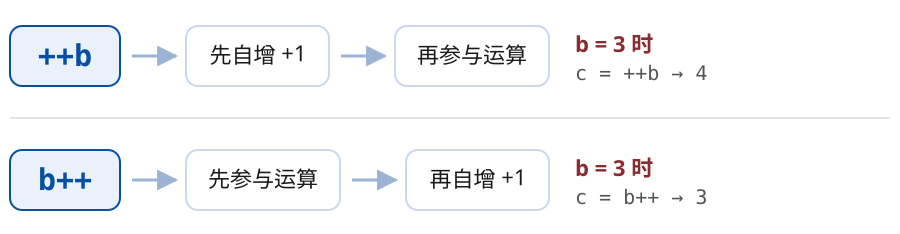
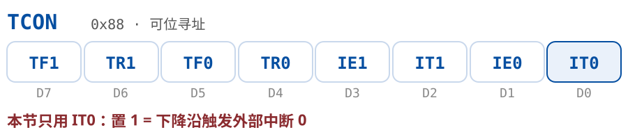
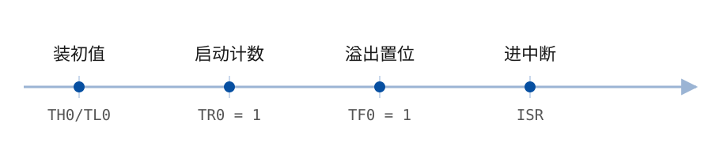

# reveal-for-obsidian

把 Obsidian 笔记变成 [reveal.js](https://revealjs.com/) 6.x 演示文稿。用纯 Markdown 写作，`---` 分页，用 `<grid>` 精确定位 + `style` 直接写 CSS 搭建版面——**不内置任何主题**，幻灯片长什么样完全由你控制。

---

## 目录

- [功能一览](#功能一览)
- [平台支持](#平台支持)
- [安装](#安装)
- [快速上手](#快速上手)
- [完整教程：从空笔记到一份课件](#完整教程从空笔记到一份课件)
- [写作规范](#写作规范)
- [命令与快捷键](#命令与快捷键)
- [分页语法](#分页语法)
- [Frontmatter 配置](#frontmatter-配置)
- [Grid 定位系统（核心）](#grid-定位系统核心)
- [演讲者备注](#演讲者备注)
- [元素与页面注释](#元素与页面注释)
- [图片、视频与 Excalidraw](#图片视频与-excalidraw)
- [富内容：SVG / Mermaid / Chart.js / 公式](#富内容svg--mermaid--chartjs--公式)
- [Emoji 与 Font Awesome](#emoji-与-font-awesome)
- [自定义样式与 CSS 变量](#自定义样式与-css-变量)
- [导出 PDF / HTML / PPTX](#导出-pdf--html--pptx)
- [版面辅助线（调版面利器）](#版面辅助线调版面利器)
- [设置项说明](#设置项说明)
- [常见问题（排障）](#常见问题排障)
- [VSCode 扩展（规划中）](#vscode-扩展规划中)
- [本地开发](#本地开发)
- [架构简介](#架构简介)

---

## 功能一览

- **Markdown → 幻灯片**：`---` 水平分页，`xxx` 垂直分页，也支持按标题级别自动分页
- **`<grid>` 绝对定位**：百分比坐标、方位关键字、负偏移（距右/下边缘），把任何内容放到画布任何位置
- **动画**：reveal.js fragment 渐显、animate.css 风格入场动画、12 种内置图形裁切（shape）
- **演讲者备注**：`note:` 逐页备注，按 `S` 打开演讲者视图
- **Obsidian 原生语法**：wikilink 图片（`![[img.png|800]]`）、视频、Callout、脚注、Excalidraw
- **富内容**：Mermaid 图表、Chart.js 图表、代码高亮、数学公式、Emoji 短代码、Font Awesome
- **配套 skill**：`.claude/skills/slide-figure`，一句话生成可编辑的 ```svg 示意图（声明 → Python 渲染）
- **实时预览**：停止输入 300ms 后自动刷新，切换笔记自动跟随
- **导出**：PDF（打印视图）、可离线播放的单文件 HTML、以及**可编辑的 PPTX**（PowerPoint / WPS 直接打开）
- **安全设计**：预览运行在隔离 iframe 中，由仅监听 `127.0.0.1` 的本地服务器承载

## 平台支持

| 平台 | 预览 | 图片/视频 | HTML 导出 | PDF 导出 | PPTX 导出 |
|------|------|-----------|-----------|----------|-----------|
| macOS / Windows / Linux | 本地服务器 | ✅ | ✅ | ✅ | ✅ |
| iOS / Android | 内联渲染 | ✅ | ❌ | ❌ | ❌ |

**桌面端**走本地 HTTP 服务器（仅监听 `127.0.0.1`），支持增量刷新，路径处理已按
Windows 的盘符与反斜杠适配（`C:\Users\...` 与 URL 里的 `/C:/Users/...` 互转）。

**移动端**没有 Node，起不了服务器，改走**内联渲染**：把 reveal 运行时和样式内联成一个
页面，用 `blob:` URL 挂到 iframe 上，幻灯片数据由插件 `postMessage` 推送，编辑时只发
数据、不重建页面。blob 与宿主同源，所以 Obsidian 的图片资源照常加载。

移动端的两点取舍：
- **三种导出都不可用**：PDF 依赖桌面浏览器的打印对话框，HTML 与 PPTX 要读写文件系统，
  移动端两样都没有。需要导出时请在桌面端打开同一个库。
- 内联页面把整个 reveal 运行时（含 Mermaid、Chart.js、MathJax，约 7 MB）打进一个 blob，
  首次打开预览会有一两秒加载；之后编辑刷新不受影响。

### 沉浸式预览（手机上尤其值得开）

竖屏手机上，Obsidian 的标题栏、底部悬浮工具条、状态栏加起来能吃掉近半屏高度，
16:9 画布再让出上下黑边，幻灯片只剩中间窄窄一条。点标题栏的 **⤢**（或命令面板执行
**Toggle Immersive Preview**、面板「⋯」菜单选 **Immersive preview**）进入沉浸式：

- 预览铺满整块屏幕，外壳全部隐去，右上角留一个 **✕** 退出（沉浸式下标题栏也没了，
  这是唯一的出口）。
- **自动横过来**：16:9 画布竖屏只能用掉屏幕宽度那一条，横过来几乎铺满，同一部手机
  幻灯片能大出两倍不止。先试系统转屏（`screen.orientation.lock`），iOS 上没有这个 API、
  安卓要求先进全屏，转不动就把预览整体旋转 90° —— 这时**把手机向左转**（顶部朝左）
  画面就是正的。系统没锁方向的话，你一转手机 Obsidian 自己就横过来了，插件会撤掉旋转，
  两条路不会打架。
- **轻点操作**：屏幕横向三等分，跟电子书阅读器一个习惯——**左三分之一**回上一页、
  **右三分之一**下一页、**中间**呼出菜单栏（网格 / 刷新 / 重置缩放 / 退出沉浸）。
  沉浸式下标题栏是藏着的，手机上又没有命令面板快捷键，这条菜单栏就是唯一的操作入口。
  只认触摸的轻点——滑动、长按、点在链接和 reveal 控件上都不会触发，桌面端用鼠标点
  更是照旧选字点链接。
- **双指缩放**：捏合放大到 4 倍，放大后单指拖动平移，捏回去自动复位，也可以用菜单栏的
  **重置缩放**。放大期间不会误翻页（中间的菜单照常呼得出来）。
  缩放挂在 reveal 的外层容器上，不碰它自己那套画布缩放。
- 顺手申请一次 **Screen Wake Lock**，讲课时屏幕不会自己暗下去；平台不支持或被系统
  拒绝就静默跳过，不影响预览。
- 进出只在 `<body>` 上加减一个 class，**不重建 iframe** —— 否则那 7 MB 的运行时要重跑一遍。

桌面端若端口全被占用导致服务器起不来，预览会自动退到同一套内联渲染，不至于开天窗。


## 安装

> **一个包通吃**：桌面端与移动端共用同一份构建产物，不区分平台。
> iframe 需要的 reveal 运行时与样式在构建期就内联进了 `main.js`
> （Obsidian 的安装器只下载 `main.js` / `manifest.json` / `styles.css` 三个文件，
> 不会带上任何额外目录），所以这三个文件就是完整插件，代价是 `main.js` 约 7 MB。

### 手动安装（当前方式）

1. 在本仓库执行 `npm install && npm run build`（或下载 Release 产物）。
2. 把 `dist/` 目录下的 **`main.js`、`styles.css`、`manifest.json` 和整个 `assets/` 文件夹**复制到：
   `<你的库>/.obsidian/plugins/reveal-for-obsidian/`
3. 重启 Obsidian（或执行命令 `Reload app without saving`），在 **设置 → 第三方插件** 中启用 `reveal-for-obsidian`。

> `assets/` 文件夹必须一起复制——它里面是打包好的 reveal.js 运行时，缺失会导致预览空白。

### BRAT（尝鲜渠道）

1. 安装 [BRAT](https://github.com/TfTHacker/obsidian42-brat) 社区插件。
2. BRAT 设置中选择 **Add Beta plugin**，填入本仓库地址。
3. 在 **设置 → 第三方插件** 中启用。

## 快速上手

1. 新建一篇笔记，写入：

   ````markdown
   ---
   title: 我的第一场演示
   transition: fade
   ---

   # 你好

   这是第一页

   ---

   # 第二页

   - 要点 A
   - 要点 B

   <grid dim="30 20" pos="bottomright">
   放在右下角的一块
   </grid>
   ````

   > 这一步只摆位置，页面是白底黑字很正常。底色、圆角、字号统一交给 CSS，
   > 见[完整教程第 6 步](#第-6-步把外观交给-css)。

2. 按 `Alt + E`（或命令面板执行 **Show Slide Preview**）。
3. 笔记右侧出现 **Slide Preview** 面板，显示渲染后的幻灯片，方向键翻页。
   光标在源码里移到哪一页，预览就自动翻到哪一页；反过来在预览里翻页，
   源码光标也会跟到那一页（两个方向都可以在设置里关掉）。
4. **预览钉在这一篇上**：你去翻别的笔记查资料，它不会被带跑。
   想换预览对象，就在新笔记上再按一次 `Alt + E`（不用关掉面板）。
   想让它跟着当前笔记走，在设置 → Preview → Follow active note 打开。
   （想要独立窗口或放回侧边栏，见 [设置项说明](#设置项说明) 的 Preview location。）
5. 继续编辑笔记，预览会在停笔 300ms 后自动更新。

> 第一次使用如果没反应，看这里：[常见问题（排障）](#常见问题排障)。

## 完整教程：从空笔记到一份课件

这一节按真实备课流程走一遍，做出一套「封面 + 标题条 + 双栏内容 + 页脚」的课件。
每一步都可以直接复制进笔记，边写边看右侧预览。

### 第 1 步：先把画布和分页定下来

新建笔记，开头写 frontmatter，然后用 `---` 分页：

````markdown
---
title: 单片机原理与应用
size: 16:9
margin: 0.01
---

# 第 1 章 如何学习单片机

---

# 第二页
````

- `size` 决定画布比例（`16:9` / `4:3` / `21:9`，也可以写 `1920x1080`）。
  frontmatter 里的 `16:9` 会被 YAML 当成时间解析，插件已经做了还原，照写即可。
- `margin` 是画布四周留白（0~1），做满版设计就调小。
- 想按标题自动分页，设置里填 Heading divider（比如 `1,2`），就不用手写 `---` 了。

按 `Alt + E` 打开预览，此时应该已经能翻页了。

### 第 2 步：用 `<grid>` 摆版面

本插件**不内置主题**，版面全靠 `<grid>` 定位。一个 grid 就是画布上的一个矩形框：

````markdown
<grid dim="76 24" pos="12 30" class="cover">

# 第 1 章 如何学习单片机

《单片机原理与应用》

</grid>
````

- `dim="76 24"`：宽 76%、高 24%（相对画布）。
- `pos="12 30"`：左边距 12%、上边距 30%。**数值定位对齐的是左上角**。
- `class="cover"`：给这块起个名字，**长什么样在第 6 步统一定义**。
- 里面照常写 Markdown，标题、列表、图片都会正常渲染。

> **这一步先别管好看。** 现在预览里是白底黑字、方方正正，正常——先把位置摆对，
> 底色圆角字号留到第 6 步一次性交给 CSS。

关键字定位更省事，而且对齐的是对应的边或角：

````markdown
<grid dim="100 12" pos="top" class="bar">
## 课程概述
</grid>

<grid dim="40 7" pos="-6 -8" class="motto">
厚德、博学、善思、致用
</grid>
````

`pos="top"` 是顶边居中，`pos="-6 -8"` 是**距右边 6%、距下边 8%**（右下角对齐）。
写 `bottomright` 就是严丝合缝贴右下角。

> **尺寸位置只有 `dim` / `pos` 两个名字。** 早期还认 `dimension`/`position` 和
> advanced-slides 的 `drag`/`drop`，现已全部作废——写这些名字的 grid 会被当成
> 「没写尺寸位置」，拿到默认的满画布居中，而不是报错。从 advanced-slides 搬过来的
> 笔记，把 `drag`→`dim`、`drop`→`pos` 全文替换一遍即可，取值语义完全相同。

### 第 3 步：一屏放两栏

两个 grid 各占一半，位置完全可控：

````markdown
<grid dim="43 66" pos="6 16" class="abstract">
### 今天的核心问题

- Q1 单片机是什么？
- Q2 为什么要学它？
</grid>

<grid dim="43 66" pos="51 16" class="abstract">
### 本课大纲

- 答疑解惑
- 实战演示
</grid>
````


### 第 4 步：插图、备注、逐步显示

````markdown
<grid dim="45 60" pos="5 25">
![[原理图.png|800]]
</grid>

<grid dim="45 60" pos="52 25" frag="1">
这段会在按一次方向键之后才出现
</grid>

note:
这里是讲稿，只有演讲者视图（按 S）能看到，可以写多行 Markdown。
````

- `![[图片.png|800]]` 指定宽度，`|800x600` 指定宽高。
- `frag="1"` 让这个 grid 变成 reveal.js 的 fragment，数字是出现顺序。
- `note:` 之后到本页结束都算演讲者备注。**注意它是按页生效的**，写在哪一页就属于哪一页。

### 第 5 步：放代码、公式和示意图

理工科课件的三样硬通货。三者都有独立的详细章节，这里只讲怎么用起来。

**代码**——围栏带语言标记，讲到哪几行就在标记旁写哪几行：

````markdown
<grid dim="52 62" pos="5 20">

```c [2,4-6]
#include <reg52.h>
sbit LED = P0^0;

void main()
{
    while(1) { LED = 0; }
}
```

</grid>
````

`[2,4-6]` 标出第 2、4~6 行，其余行淡下去；`[1-2|3|4-6]` 是**分步**，每按一次方向键换一组。
代码块自动带行号，宽度由 grid 决定，装不下会自动缩字号。
详见[写作规范里的代码页](#五版式模板)。

**公式**——跟 Obsidian 笔记里写法完全一致，`$...$` 行内、`$$...$$` 独占一行：

```markdown
当 $I_b ≈ 0$ 时电路断开：

$$I_C = \beta \times I_b$$
```

预览里由 MathJax 排成 SVG，跟着上下文字号缩放，颜色随 `currentColor` 走。
详见[数学公式](#数学公式)。

**示意图**——别贴位图，写 ```` ```svg ````：

````markdown
<grid dim="60 40" pos="5 25" class="fig">

```svg
<svg xmlns="http://www.w3.org/2000/svg" viewBox="0 0 900 250">…</svg>
```

</grid>
````

位图投影必糊，而且改一个字要重新出图；SVG 是矢量，放多大都锐利，改字就是改一行代码。
笔记里 ```` ```svg ```` 块会自动折叠，不会把正文撑乱。
仓库带了个[配套 skill](#配套-skill一句话生成示意图) 帮你生成。

> **三样都别和右侧的文字列表重复。** 图讲图的、字讲字的——同一件事说两遍，
> 观众不知道该看哪边，这是课件"割裂感"最常见的来源。

### 第 6 步：把外观交给 CSS

前面几步只摆了位置，页面还是白底黑字。现在一次性把「长什么样」定义出来——
之后所有页面共用，改一处全课跟着变。

先在笔记任意位置放一个 `<style>` 块（它会被提取成文档级 CSS，不出现在正文里）：

````markdown
<style>
/* 1. 设计变量：颜色只在这里定义一次 */
:root {
  --brand: #064FA1;
  --muted: #6B6B6B;
}

/* 2. 全局基调 */
.reveal .grid { line-height: 1.55; }
.reveal .grid img { max-width: 100%; max-height: 100%; object-fit: contain; }

/* 3. 版式 class：一个 class 就是一类页面的完整外观 */
.cover {
  background: var(--brand); color: #fff;
  border-radius: 16px; padding: 0 48px; text-align: center;
}
.cover h1 { font-size: 2.5rem; margin: 0; }
.cover p  { font-size: .7rem; margin: .4em 0 0; opacity: .85; }

.bar {
  background: var(--brand); color: #fff;
  border-radius: 15px; padding: 0 3%;
  align-items: flex-start; text-align: left;
}
.bar h2 { font-size: 1.3rem; margin: 0; }

.fig  { padding: 0; text-align: center; }
.foot { background: var(--brand); color: #fff; border-radius: 15px; font-size: .8rem; text-align: center; }
</style>
````

笔记正文这才配齐——**每个 grid 仍然只有 `dim`、`pos`、`class` 三个属性**：

````markdown
<grid dim="100 10" pos="top" class="bar">
## 课程概述
</grid>

<grid dim="76 24" pos="12 30" class="cover">
# 第 1 章 如何学习单片机
</grid>

<grid dim="100 10" pos="bottom" class="foot">
2026 年秋《单片机原理与应用》
</grid>
````

一个 class 名字换掉一整串样式，这就是**改一处、全局跟着变**的来源。

**下一步是把这段 CSS 搬出笔记。** 一门课十几章，封面、标题条、页脚每章都要用，
留在单篇笔记里等于每章复制一遍。存成 vault 里的一个文件，frontmatter 指过去：

```yaml
---
css: 00课件CSS主题        # 主题笔记的名字，写名字就行
---
```

三级放法（课程主题 / 笔记专属 / 单页例外）、路径写法、以及为什么样式文件本身可以是
一篇 `.md` 笔记，见[写作规范 · 二、文件骨架](#二文件骨架)。

### 第 7 步：对不齐的时候打开辅助线

点 Slide Preview 面板标题栏的**网格按钮**（或命令面板执行 **Toggle Grid Guides**）：画布上会铺一层 10% 的标尺，
每个 grid 画出虚线边框，左上角标出它的「宽×高 @ left top」。
照着标尺调 `dim` / `pos`，比反复试数字快得多。调完再执行一次关掉。

### 光标跟随

写长篇课件时，源码里光标移到第几页，预览就自动翻到第几页——不用手动翻页找位置。
它按**源码行号**定位，`<style>` 块和 frontmatter 占的行数都算进去了，所以不会错位。
不需要就在设置 → Preview → Follow cursor 关掉。

**反过来也成立**：在预览里翻页（方向键、控件、Esc 总览里点选），
源码光标会自动跳到那一页的起始行并滚动到可见——通读一遍幻灯片，
看到哪页不对劲，回到编辑器就已经停在那页的源码上了。
不需要就在设置 → Preview → Follow slide 关掉。

两个方向不会互相打架：光标在某页正中间打字时，预览翻到这页并不会把光标拽回页首；
预览因为编辑重渲染而恢复位置，也不会去动光标。焦点始终留在预览里，
光标跟过去之后你仍可以继续用方向键翻页。

### 第 8 步：讲课与交付

- 放映：预览面板里按 `F` 全屏，`S` 打开演讲者视图（看备注和计时），`Esc` 总览所有页。
- 发学生：**Export Slides as HTML**，导出单文件 HTML，图片一并打包，脱离 Obsidian 也能放。
- 要 PDF：**Export Slides as PDF**，打开打印视图后在浏览器里「打印 → 另存为 PDF」。
- 交给别人接着改：**Export Slides as PPTX**，导出 PowerPoint 文件，文字仍是文本框、
  图片仍是图片、表格仍是表格，对方用 Office / WPS 打开就能直接编辑。

预览面板标题栏有五个按钮，从左到右：**刷新**、**辅助线开关**、**导出 PDF**、**导出 HTML**、
**导出 PPTX**，不必去命令面板。右上角的「⋯」菜单里也有同样的导出项。

### 常见的坑

| 现象 | 原因 |
|------|------|
| grid 里的内容跑到页面外 | `pos` 用关键字/负数时对齐的是元素的边或角，用数值时对齐左上角，两者别记混 |
| 代码块里的 `---` 把页面切开了 | 不会：分页前会先标记代码块范围并跳过。若真被切开，检查是不是缩进代码块没写围栏 |
| 图片太大撑破 grid | 加一条 `.reveal .grid img { max-width: 100%; max-height: 100%; }`（只封顶，不改尺寸） |
| 图片写了 `\|800` 却没反应 | 主题里有铺满格子的规则（`width: 100%` / `height: 100%`），给它加上 `:not([width])`，让写了尺寸的图走自己的路 |
| 改了设置没反应 | 端口类改动要重启服务器（改完点输入框外面会自动重启）；其余改完会立即重渲染 |


## 写作规范

上面的教程带你跑通一遍；成篇成套地做课件时，按这套规矩写，才能**改一处、全局跟着变**，
而不是每页都在调数字。

### 一、核心规范：`<grid>` 只管位置，外观全在 CSS 里

这是本规范里最重要的一条。**grid 标签上只写三个属性：`dim`、`pos`、`class`。**

| 层 | 写在哪 | 管什么 | 例子 |
|----|--------|--------|------|
| **位置** | grid 的 `dim` / `pos` | 这块内容在画布的哪、多大 | `dim="76 24" pos="12 30"` |
| **版式** | 课程 CSS 里的 class | 这类页面长什么样——底色、圆角、内边距、字号、行距、对齐，**全部** | `.cover { … }` |
| **例外** | grid 的 `style` | 只此一次的临时调整，能不用就不用 | 这一页的图要加个边框 |

判断规则只剩一条：**这个外观会不会在别的页面再出现？** 会 → 进 class。
一门课十几章，封面、标题条、正文栏、页脚反复出现，答案几乎永远是「会」。

于是一页课件长这样，干干净净：

```markdown
<grid dim="100 10" pos="top" class="bar">
## 认识 LED 小灯
</grid>

<grid dim="55 70" pos="4 14" class="fig">
![[原理图.png]]
</grid>

<grid dim="38 70" pos="60 14" class="abstract">
- 单向导电性
- 典型压降 1.8~3.3 V
</grid>
```

看不到一个颜色值、一个像素数。想让全课的标题条换个色？改 CSS 里 `.bar` 那一处。

#### 为什么不把外观写在 grid 上

把底色、圆角、内边距直接写在 grid 标签上，第一次很爽——所见即所得，不用跳文件。
代价在后面：

- 一门课十几章、几百页，同样的串复制几百遍
- 改设计要全文替换，漏一处就有一页跟别人不一样
- 笔记正文被样式淹没，翻页找内容得跳过一堆 CSS
- 同一个版式在不同章节慢慢长歪，谁也说不清哪个才是标准

**第一次做的时候写在 grid 上没关系**，等第二章开始复制粘贴，就该搬进 class 了。

#### 一页封面长什么样

笔记里只有位置和名字：

```markdown
<grid dim="76 24" pos="12 30" class="cover">

# 第1章 如何学习单片机

《单片机原理与应用》

</grid>
```

外观全在课程 CSS，一次定义，十几章通用：

```css
.cover {
  background: var(--brand);
  color: #fff;
  border-radius: 16px;
  padding: 0 48px;
  text-align: center;
}
.cover h1 { font-size: 2.5rem; margin: 0; font-weight: 600; line-height: 1.25; }
.cover p  { font-size: .7rem; margin: .4em 0 0; opacity: .85; }
```

底色、圆角、内边距、字号、行距、对齐——**一条都不在笔记里**。后面十几页封面只写
`class="cover"`，想调字号就改 CSS 里那一处。

#### `.element:` 用来加行为，不用来写样式

那 `<!-- .element: -->` 什么时候才该出场？**给正文里的单个元素挂 class 或属性**——
样式交给 class，它负责的是行为。最典型的是逐条显示：

```markdown
- 要点一<!-- .element: class="fragment" -->
- 要点二<!-- .element: class="fragment" -->
- 要点三
```

`frag` 属性只能写在 `<grid>` 上，整块一起出现；要让列表**逐条**出现，只有 `.element:` 做得到
（输出 `<li class="fragment">要点一</li>…`）。

反过来，只要你在 `.element:` 里写的是 `font-size`、`margin`、`color` 这类东西，
就说明它该进 class。

---

### 二、文件骨架

每篇课件都按这个顺序写：

````markdown
---
title: 单片机原理与应用
size: 16:9
margin: 0.01
---

<style>
/* 1. 设计变量：颜色、间距，全篇只在这里定义 */
:root {
  --brand: #B81C22;
  --brand-soft: rgba(184, 28, 34, .08);
  --muted: #6B6B6B;
}

/* 2. 全局基调 */
.reveal .grid { line-height: 1.55; }
.reveal .grid img { max-width: 100%; max-height: 100%; object-fit: contain; }

/* 3. 版式 class：封面、章节页、正文页…… */
.cover { text-align: center; }
.cover h1 { font-size: 2.5rem; margin: 0; font-weight: 600; line-height: 1.25; }
.cover p  { font-size: .9rem; margin: .4em 0 0; opacity: .85; }

.bar  { font-size: .7rem; font-weight: 600; }
.foot { font-size: .5rem; color: var(--brand); text-align: center; }

.code pre      { width: 100%; margin: 0; font-size: .62rem; line-height: 1.6; }
.code pre code { padding: .7em 1em; border-radius: 10px; background: #1e1f26; color: #e6e6e6; }
</style>

# 第一页

---

# 第二页
````

`<style>` 块会被提取成文档级 CSS，不会出现在正文里，放哪一页都行——**统一放开头**。
正文里的每个 grid 仍然只写 `dim`、`pos`、`class` 三个属性。

#### CSS 放在哪一级

`<style>` 的作用范围是**当前这一篇笔记**，不会影响别的课件。所以问题变成：
一篇课件里封面只有一页、目录只有一页，为它们单独定义 class 划算吗？

**单看一篇不划算，放到一门课来看非常划算。** 一学期十几章，每章都有封面、目录、结尾，
版式重复发生在**笔记与笔记之间**。所以按三级放：

| 级别 | 放哪 | 放什么 | 例子 |
|------|------|--------|------|
| 课程级 | 一篇主题笔记，frontmatter 里 `css:` 指定 | 配色变量 + 全套版式 class | `css: 00课件CSS主题` |
| 本篇级 | **笔记专属 CSS 文件**，或笔记开头的 `<style>` | 这一章特有的调整 | 某章要深色封面 |
| 单页级 | grid 的 `style` | 一次性的容器外观 | 这一页的图要加边框 |

#### 笔记专属 CSS：不用声明，放对位置就会加载

不想让几十行 CSS 占着笔记开头，可以放进一个跟笔记配套的 `.css` 文件。
**不需要在 frontmatter 里写任何东西**，插件按下面的顺序找，用第一个存在的：

```
理论课/第1章.css                    ← 笔记同级、同名
理论课/第1章/第1章.css              ← 同名文件夹里
理论课/第1章/style.css
理论课/assets/第1章/第1章.css       ← 附件夹里（每篇一个附件夹的布局）
理论课/assets/第1章/style.css
<你在 Obsidian 设置的附件目录>/第1章.css
<你在 Obsidian 设置的附件目录>/style.css
```

图片放哪、样式就放哪，一篇笔记的所有配套文件待在一起。
**改这个 CSS 文件，预览会立刻重渲染**，不用回去动笔记。

样式文件本身也可以是一篇 **`.md` 笔记**：把 CSS 写在 ```css 代码块里即可
（`themes/course.md`、笔记专属样式都支持）。好处是 `.css` 文件在 Obsidian 的文件树里
默认根本不显示，而 `.md` 有语法高亮、能折叠、能搜索、能双链。
要看到 `.css` 文件得先开 **设置 → 文件与链接 → 检测所有文件扩展名**。

#### 样式挪走之后怎么改

样式一旦进了独立文件，就会有「改这一页不方便」的顾虑。分开看两类改动就不冲突：

- **只影响这一页**（这张图要小一点、这段要标红）→ 写在 grid 的 `style=` 上，
  就在你正在编辑的那一行，零跳转。
- **影响一类页面**（正文字号统一调大）→ 才需要动主题文件，而这类改动本来就低频，
  通常做完前两章就定型了。

真要开主题文件时，用预览面板「⋯」菜单里的 **Open slide stylesheet**（或命令面板搜
`Open Slide Stylesheet`）——它把当前笔记生效的那份样式在旁边分栏打开，不用记路径。
样式文件的改动会**立刻触发预览重渲染**，左边改 CSS、右边看效果，不必回笔记。

还没定型的阶段，就先把 `<style>` 留在笔记里；等第二章开始复制粘贴，再搬进主题文件。

如果只是想让 `<style>` 在编辑器里不碍眼，用 Obsidian 的注释语法包起来也行——
`%%` 里的内容在实时预览和阅读视图中自动折叠，而插件照样能提取到里面的 `<style>`：

```markdown
%%
<style>
.cover { color: #fff; }
</style>
%%
```

课程主题**必须显式指定**——插件不会按目录自动套用某份样式。
一份主题改一次就影响一整片笔记，让它悄悄生效，出问题时根本无从查起；
写在 frontmatter 里，翻开笔记就知道这篇用的是哪套。

```yaml
---
title: 第1章 如何学习单片机
css: 00课件CSS主题        # 主题笔记的名字，写名字就行
---
```

路径写法很宽松，怎么顺手怎么来：

| 写法 | 说明 |
|------|------|
| `css: 00课件CSS主题` | **只写笔记名**，库里任意位置都能找到，最常用 |
| `css: theme/course.md` | 相对本篇笔记所在目录 |
| `css: theme/course` | 省略扩展名，先试 `.md` 再试 `.css` |
| `css: "[[course]]"` | wikilink，能自动补全、笔记改名后自动跟随 |
| `css: [a.md, b.css]` | 多份，按顺序叠加 |
| `css: 课程/主题.css` | 库内绝对路径 |

样式文件是 `.md` 时，取其中的 ```` ```css ```` 代码块与 `<style>` 块，正文一概忽略——
所以主题笔记里可以正常写说明、写版式对照表。

**优先级**（后加载的覆盖先加载的）：课程主题 → 笔记专属 CSS → 笔记内 `<style>` → grid 的 `style`。
想让某一章的封面换个颜色，在后面任意一级写一句就行，不用去动主题文件。

`themes/course.css` 的结构照抄上面的骨架即可：变量 → 全局基调 → 版式 class。
建议按幻灯片的角色命名，一门课固定这几个就够：

```css
.cover  /* 封面 */
.toc    /* 目录 */
.bar    /* 每页顶部的标题条 */
.code   /* 代码面板 */
.foot   /* 页脚条 */
.end    /* 结尾页 */
```

第一次做的时候可以都写在笔记的 `<style>` 里，等第二章开始复制粘贴时，
再把稳定下来的部分挪进 `themes/course.css`——不必一开始就设计。

---

### 三、单位规范

| 用途 | 单位 | 理由 |
|------|------|------|
| grid 的位置和尺寸 | 画布百分比（`dim` / `pos` 的默认单位） | 画布等比缩放，任何屏幕都成立 |
| **字号** | `rem` | 相对根字号，**不受嵌套影响** |
| 跟随字号的间距（`margin` / `padding` / `gap`） | `em` | 字号一改，间距按比例跟上 |
| 描边、圆角、发丝线 | `px` | 本来就该是固定值 |

**根字号 = 画布宽度 ÷ 1920 × 40px**。16:9 画布下 `1rem = 40px`，换成 4:3 会自动变小，
所以用 `rem` 写的字号在改画布比例后仍然协调。

#### 为什么字号别用 `em`

`em` 在 `font-size` 上参照的是**父元素**，嵌套时会连乘：

```css
.reveal .grid { font-size: .62em; }   /* grid 套 grid 时 → .62 × .62 = .38em，越套越小 */
```

要么改用 `rem`，要么加一行防护：

```css
.reveal .grid .grid { font-size: 1em; }
```

---

### 四、命名约定

- class 用**语义名**，不用外观名：`.cover`、`.section-title`、`.footnote`，
  而不是 `.big-red`、`.font24`。改设计时不用改名字。
- 颜色一律走变量：`var(--brand)`，不要在页面里散落 `#B81C22`。
- 一个 class 只管一类版式；需要组合时叠加：`class="cover dark"`。

---

### 五、版式模板

直接复制改用。**每个 grid 只有 `dim`、`pos`、`class`**，class 的定义见上面的 `<style>` 骨架
（真正做课件时它在课程 CSS 文件里）。

#### 封面页

```markdown
<grid dim="22 12" pos="6 7" class="fig">
![[校徽.png]]
</grid>

<grid dim="76 24" pos="12 30" class="cover">

# 第1章 如何学习单片机

《单片机原理与应用》

</grid>

<grid dim="80 6" pos="10 60" class="byline">
合肥大学人工智能与大数据学院 · 张建武
</grid>
```

配套 class：

```css
.cover { background: var(--brand); color: #fff; border-radius: 16px; padding: 0 48px; text-align: center; }
.cover h1 { font-size: 2.5rem; margin: 0; }
.cover p  { font-size: .7rem; margin: .4em 0 0; opacity: .85; }
.byline { font-size: .7rem; color: var(--muted); text-align: center; }
.fig { padding: 0; text-align: center; }
```

#### 标准内容页（标题条 + 双栏 + 页脚）

```markdown
<grid dim="100 10" pos="top" class="bar">
## 课程概述
</grid>

<grid dim="43 66" pos="6 16" class="abstract">
### 今天的核心问题

- 单片机是什么？
- 为什么要学它？
</grid>

<grid dim="43 66" pos="51 16" class="abstract">
### 本课大纲

- 答疑解惑
- 实战演示
</grid>

<grid dim="100 10" pos="bottom" class="foot">
2026年秋《单片机原理与应用》
</grid>
```

配套 class：

```css
.bar { background: var(--brand); color: #fff; border-radius: 15px; padding: 0 3%; align-items: flex-start; text-align: left; }
.bar h2 { font-size: 1.3rem; margin: 0; }
.bar h3 { font-size: 1.05rem; margin: 0; }   /* 小节标题条，比 h2 降一档 */

.foot { background: var(--brand); color: #fff; border-radius: 15px; font-size: .8rem; text-align: center; }
```

#### 图文页

```markdown
<grid dim="55 70" pos="4 14" class="fig">
![[原理图.png]]
</grid>

<grid dim="38 70" pos="60 14" class="abstract">
- 要点一
- 要点二
</grid>
```

配套 class（`.abstract` 字大、居中，专给「只留结论」的那一栏用）：

```css
.abstract { justify-content: center; align-items: center; text-align: left; font-size: 1.1rem; line-height: 1.7; }
.abstract h3 { font-size: .9rem; margin: 0 0 .6em; }
```

#### 代码页（代码 + 讲解）

`class="code"` 的 grid 里放一个代码块，语言标记决定高亮，同一个 class 什么语言都能装。

````markdown
<grid dim="50 60" pos="5 18" class="code">

```c
// 单片机C语言SFR声明
sfr P0 = 0x80;       // SFR 声明
sfr TCON = 0x88;
sbit IT0 = TCON^0;   // 位声明
sbit LED = P0^0;
```

</grid>

<grid dim="38 60" pos="57 18">
- `sfr` 声明 8 位特殊功能寄存器
- `sbit` 声明可寻址位
</grid>
````

三点注意：

- **围栏要带语言标记**（```` ```c ````、```` ```python ````），高亮全靠它；不写就是一片白字。
- **字号别一页页手动调**：代码在 grid 里放不下时会自动往下缩字号（缩到 10px 仍放不下
  才整体缩放），`.code` 里的 `.62rem` 是「放得下时」的字号。嫌小就把 grid 开大。
- **长行不折行**，超宽同样触发自动缩小，而且缩的是整块——一行 120 列的代码会把
  另外五行也一起拖小。该断行就断行，或者拆成两块 grid。
- **代码框按代码宽度收缩**，最宽不超过所在 grid。短代码不会拉出一条通栏的深色长条；
  它和 `ul`、`h2` 一样服从 grid 的 `align-items`（默认居中，想靠左就在 class 里写
  `align-items: flex-start`）。

##### 标出讲到的是哪几行

语言标记旁写行号，讲到哪几行就标哪几行——加了行号栏，标中的行正常显示，其余行淡下去：

````markdown
```c [2,4-6]
#include <reg52.h>
sfr P0 = 0x80;
sfr TCON = 0x88;
sbit IT0 = TCON^0;
sbit LED = P0^0;
void main(void) { }
```
````

| 写法 | 效果 |
| --- | --- |
| `[2]` | 第 2 行 |
| `[2,5]` | 第 2、5 行 |
| `[4-6]` | 第 4 到 6 行 |
| `[2,4-6]` | 混着写 |
| `[1-2\|3\|4-6]` | **分步**：竖线分组，每按一次方向键换一组（每组是一个 fragment） |
| `[]` | 只加行号，不淡化任何行 |

花括号 `{2,4-6}` 是同义写法，看哪种顺手。三点注意：

- **行号和高亮是绑在一起的**（reveal 的 `data-line-numbers` 一个属性管两件事），
  没法只淡化不显示行号。
- **淡下去的行是 40% 透明度**，注释本来颜色就暗，淡完基本看不见。想留一点可读性，
  在页内 `<style>` 里抬一档：`.reveal .hljs.has-highlights tr:not(.highlight-line){opacity:.6}`。
- 等价的完整写法是紧跟代码块的 `<!-- .element: data-line-numbers="2,4-6" -->`，
  需要 `data-ln-start-from`（行号从第几行起算）时用它。

---

### 六、反模式

| 别这么写 | 为什么 | 改成 |
|---------|--------|------|
| 在 grid 上写底色、圆角、内边距 | 一门课几百页复制同一串，改设计要全文替换 | 抽成 class，grid 上只留 `dim`/`pos`/`class` |
| 在 class 里写 `align-items: center` | `.grid` 默认就是居中，纯属重复 | 删掉；要左对齐才写 `align-items: flex-start; text-align: left` |
| 正文里堆 `<!-- .element: -->` | 正文变脏、不可复用 | 用 class |
| `font-size` 用 `em` | 嵌套连乘 | 用 `rem` |
| 页面里散落 `#B81C22` | 改配色要全文替换 | `var(--brand)` |
| 靠反复试数字对齐 | 慢 | 开辅助线照着 10% 标尺调 |

---

### 七、交付前检查清单

0. **扫一眼 grid 标签**：除了 `dim`、`pos`、`class`，还剩别的属性吗？剩了就说明有外观没归位。
1. **开辅助线**（面板标题栏的网格按钮）：看每块的边框和 `宽×高 @ left top`，确认没有越界、没有意外重叠。
2. **把预览面板拖窄**：一切等比缩放，小面板里看着费劲的字，投到大屏上同样费劲。
3. **确认画布比例**与投影设备一致（`size: 16:9` / `4:3`）；不一致不会裁切，但会留黑边。
4. **按 `S`** 过一遍演讲者视图，确认备注都在该在的页上。
5. **导出 HTML** 试放一次，确认图片都跟着打包了（导出目录的 `files/`）。

---

### 八、速查

| 需求 | 写法 |
|------|------|
| 放到画布某处 | `<grid dim="宽 高" pos="左 上">` |
| 贴边 / 居中 | `pos="topleft"` / `top` / `center` / `bottomright` |
| 距右下留白 | `pos="-6 -8"`（负数 = 距右/下边缘） |
| 逐步显示 | `frag="1"` |
| 图形裁切 | `shape="hexagon"` |
| 演讲备注 | 页面末尾 `note:` 起，到本页结束 |
| 指定图片宽度 | `![[图.png\|800]]` |
| 整页背景 | `<!-- .slide: background-color="#101010" -->` |

## 命令与快捷键

| 命令 | 快捷键 | 作用 |
|------|--------|------|
| Show Slide Preview | `Alt + E` | 打开/聚焦预览面板，并把预览对象**绑到当前笔记** |
| Reload Slide Preview | `Ctrl/Cmd + Shift + R` | 强制重跑管线并刷新，标题栏也有按钮 |
| Start Slide Preview Server | — | 手动启动本地预览服务器 |
| Stop Slide Preview Server | — | 停止服务器 |
| Open AI Prompt | — | 打开（没有就先创建）AI 提示词文件，改完立刻生效 |
| Extract SVG Figures to Files | — | 把当前笔记里的 ```` ```svg ```` 块搬进 `assets/<笔记名>/`，正文换成链接 |
| Toggle Immersive Preview | — | 预览铺满整屏、隐去 Obsidian 外壳，标题栏与「⋯」菜单也有（见[沉浸式预览](#沉浸式预览手机上尤其值得开)） |
| Toggle Grid Guides | — | 开关版面辅助线（grid 边框 + 10% 标尺），标题栏也有按钮 |
| Open Slide Stylesheet | — | 分栏打开当前笔记生效的样式文件，「⋯」菜单也有 |
| Fold / Unfold SVG Code Blocks | — | 折起/展开笔记里所有 ```svg 块（默认打开笔记时已自动折） |
| Export Slides as PDF | — | 打开打印视图（浏览器中 打印 → 另存为 PDF），标题栏与「⋯」菜单也有 |
| Export Slides as HTML | — | 导出单文件离线 HTML 到导出目录，标题栏与「⋯」菜单也有 |
| Export Slides as PPTX (PowerPoint) | — | 导出可编辑的 .pptx 到导出目录，标题栏与「⋯」菜单也有 |

## 分页语法

| 语法 | 效果 |
|------|------|
| `---`（独占一行） | 水平分页（下一张） |
| `xxx`（独占一行） | 垂直分页（向下叠放，方向键 ↓ 进入） |
| Frontmatter `headingDivider: [1, 2]` | 按标题级别自动分页 |

- 分隔符写成代码块（```` ``` ````）或行内代码里的内容**不会**触发分页。
- 分隔行**行尾的空格、Tab 会被忽略**：`---` 后面多打了空格照样分页。
- 设置页里的分隔符既可以填**纯文本标记**（如 `---`、`xxx`，按整行匹配），也可以填**正则表达式**（如 `\r?\n--\r?\n`）。
- 连续分隔符产生的空白页会被自动过滤。

```markdown
# 第一页

---

# 第二页

xxx

# 第二页的垂直子页
```

## Frontmatter 配置

笔记顶部的 YAML frontmatter 可以覆盖插件设置（仅对本篇笔记生效）：

```yaml
---
title: 产品发布会          # 演示标题（导出 HTML 的文件名/标题）
size: 16:9                 # 画布：16:9 / 4:3 / 21:9 / 1920x1080
margin: 0.04               # 页面边距（0~1）
transition: slide          # none/fade/slide/convex/concave/zoom
transitionSpeed: default   # default/fast/slow
controls: true             # 右下角导航箭头
progress: true             # 底部进度条
slideNumber: true          # 页码（true/false/'c/t'），显示在右上角
center: true               # 内容垂直居中
bg: '#1e1e2e'              # 全局背景（颜色或图片 URL）
css: [styles/custom.css]   # 追加 vault 内 CSS 文件
prompt: Extra/提示词       # 这一篇专用的 AI 提示词（可省扩展名）
remoteCSS: [https://...]   # 追加远程 CSS
separator: '\r?\n---\r?\n' # 自定义水平分页符
verticalSeparator: xxx     # 自定义垂直分页符
headingDivider: [1, 2]     # 按 1、2 级标题自动分页
notesSeparator: 'note:'    # 自定义备注起始标记
enableOverview: true       # Esc 总览模式
scrollActivationWidth:     # 留空=禁用滚动视图自动切换
---
```

> `size: 16:9` 这类「数字:数字」写法会被 YAML 1.1 解析成六十进制数，插件已自动还原，直接写即可。

## Grid 定位系统（核心）

`<grid>` 是本插件的版面基础：一个**绝对定位**的容器，把内容精确放到画布上。

```markdown
<grid dim="60 30" pos="20 25" class="abstract">
这里的 Markdown 会正常渲染：**加粗**、列表、图片都可以
</grid>
```

### 属性一览

| 属性 | 说明 | 示例 |
|------|------|------|
| `dim` | 尺寸「宽 高」，画布百分比 | `dim="60 30"` |
| `pos` | 位置「左 上」，写法见下表 | `pos="20 25"` |
| `style` | 内联 CSS，原样透传。**一次性的例外才用**，日常外观请写进 class | `style="border: 1px dashed red"` |
| `class` | 追加 HTML class | `class="card shadow"` |
| `shape` | 图形裁切（12 种内置） | `shape="hexagon"` |
| `frag` | reveal.js fragment（数字=顺序，或动画名） | `frag="1"` / `frag="fade-up"` |
| `animate` | 入场动画类（animate.css 命名） | `animate="fade-in"` |

> **单位一律是画布百分比。** reveal.js 会把整块画布（默认 1920×1080）等比缩放到窗口，
> 所以百分比布局在笔记本、投影仪、4K 大屏上表现一致，不需要也不提供绝对像素定位。
>
> **只认这七个属性名。** 写别的（比如 advanced-slides 的 `align` / `flow` / `bg`，
> 或早期支持过的 `dimension` / `position` / `drag` / `drop`）不会报错，会被静默忽略——
> 这一点要留神：`<grid drag="70 60" drop="0 17">` 不会报红，它会**安静地**变成
> 满画布居中的块，看上去像"版面塌了"。排查时先确认属性名拼对了没有。
>
> advanced-slides 的对照：`drag`→`dim`、`drop`→`pos`（取值语义相同，直接替换）；
> `align` / `flow` 在 class 里用 `align-items` / `flex-direction` 代替。

### pos 写法

| 写法 | 含义 |
|------|------|
| `pos="20 25"` | left 20%、top 25% |
| `pos="top"` | 顶部居中（另一轴自动居中） |
| `pos="left"` / `right` / `bottom` / `center` | 同理 |
| `pos="topleft"` / `topright` / `bottomleft` / `bottomright` | 四个角 |
| `pos="left top"` | 两个关键字组合 |
| `pos="-6 -8"` | **负数 = 距右/下边缘**（生成 `calc(100% - 6%)`） |

> **定位锚点**：数值写法（`20 25`）对齐的是元素**左上角**；关键字与负数写法对齐的是元素对应的边或角
> —— `center` 是元素中心落在画布中心，`bottomright` 是元素右下角贴画布右下角，`-6 -8` 是元素右下角距右/下边缘 6%/8%。

### shape 内置图形

`circle` `ellipse` `triangle` `triangle-down` `diamond` `hexagon` `pentagon` `star` `arrow` `chevron` `parallelogram` `ribbon`

```markdown
<grid dim="20 20" pos="topright" shape="hexagon" class="badge">
</grid>
```

裁切只决定形状，底色仍由 class 给：`.badge { background: var(--accent); }`

> shape 表外的值会原样透传为 `clip-path`，可以写任意 CSS 裁切函数。

### 嵌套

`<grid>` 可以嵌套：内层 grid 的百分比是**相对外层 grid**算的，适合先划分区域再在区域内排版。

```markdown
<grid dim="90 60" pos="center" class="panel">
<grid dim="45 80" pos="left" class="abstract">左半</grid>
<grid dim="45 80" pos="right" class="abstract">右半</grid>
</grid>
```

### 属性自动补全

在笔记里输入 `<grid ` 会弹出属性名候选；`pos="` / `shape="` / `frag="` / `animate="`
还会提示可用取值。不需要可在设置 → Preview → Autocomplete 关掉。

### 完整示例：封面页

```markdown
<grid dim="80 20" pos="top" class="cover">
# 产品发布会
</grid>

<grid dim="30 40" pos="10 40" class="card">
左侧卡片
</grid>

<grid dim="30 40" pos="-10 40" shape="parallelogram" class="card">
右侧图形块
</grid>
```

对应的 class：

```css
.cover { text-align: center; }
.card  { background: var(--brand); color: #fff; border-radius: 12px; padding: 1em; }
```


## 演讲者备注

每页末尾以 `note:`（可在设置/frontmatter 改）起头的部分是演讲者备注，不进幻灯片正文：

```markdown
# 某一页

note:
这里写提词内容，
可以是多行 Markdown。
```

放映时按 `S` 打开演讲者视图（含备注与计时器）。

## 元素与页面注释

```markdown
- 要点一<!-- .element: class="fragment" -->
- 要点二<!-- .element: class="fragment" -->

<!-- .slide: background-color="#2d2d2d" -->
```

- `<!-- .element: ... -->`：作用于**紧邻的上一个元素**，支持 `class="..."` 及任意 `key="value"` 属性。
  最典型的用途就是上面这个——给列表项挂 `class="fragment"` 实现**逐条**显示；
  `frag` 属性只能写在 `<grid>` 上，那是整块一起出现。
  它也能写 `style="..."`，但**外观请一律走 class**，理由见[写作规范](#一核心规范grid-只管位置外观全在-css-里)。
- `<!-- .slide: ... -->`：作用于**当前页**，背景相关键（`background-color`、`background-image`、`background-size` 等）会自动映射为 reveal.js 的 `data-background-*`。

## 图片、视频与 Excalidraw

| 语法 | 效果 |
|------|------|
| `![[photo.png]]` | Vault 内图片（经本地服务器加载） |
| `![[photo.png|800]]` / `![[photo.png|800x600]]` | 指定宽 / 宽×高 |
| `` | 远程图片，原样保留 |
| `![[clip.mp4]]` | 视频（mp4/webm/ogv/mov/m4v）自动包装为带控件的 `<video>` |
| `![[sketch.excalidraw]]` | 存在同名 `.png` 时引用该图；否则保留链接（完整渲染需 Excalidraw 插件导出） |

### 尺寸与主题 CSS 谁说了算

`|800` 会以**内联样式**（`style="width: 800px; height: auto"`）落到 `` / `<video>` 上，
压得住主题里的通用规则——写在 Markdown 里的尺寸就是最终尺寸。只封顶的 `max-width` / `max-height`
仍然有效，图片不会撑破格子。

反过来，主题想给「没写尺寸的图」铺满格子时，要主动给写了尺寸的图让路：

```css
/* 只有没写 |800 的图才铺满格子 */
.fig img:not([width]) { width: 100%; height: 100%; min-height: 0; object-fit: contain; }
```

漏掉 `:not([width])` 的后果是：`|800` 改成 `|400` 画面纹丝不动。

铺满格子请用上面这种 flex 写法，别用 `position: absolute; inset: 0`——
图片脱离文档流后，同一格里的说明文字不会被让位，直接被整张图盖住。
留在文档流里则是 flex 子项，图会自动压到「格子高 − 文字高」，图与说明一起居中
（`min-height: 0` 不能省，flex 子项默认不肯缩到内容高度以下，长图会顶破格子）。

## 富内容：SVG / Mermaid / Chart.js / 公式

### SVG 代码块

````
```svg
<svg viewBox="0 0 100 100"><circle cx="50" cy="50" r="40" fill="#e74c3c"/></svg>
```
````

内容含 `<svg` 时渲染为图片，否则保持代码块。

**长动画会自动折起来。** SVG 动画动辄几十行，摊在笔记里能把正文挤没：
打开笔记时 ```svg 块自动折叠成 ```` ```svg ```` 一行，点这一行（或行号旁的箭头）展开。
折的是 CodeMirror 原生折叠，与你手动折代码块是同一套，展开手势照旧。

- 4 行以内的短块不折——折起来省不下几行，反倒多一次点击。
- 讲语法的笔记里用 ` ```` ` 包着的 ```svg 示例不会被当成真块折掉。
- 临时想全部展开/折起：命令面板的 **Fold / Unfold SVG Code Blocks**（还有没折的就全折，已经全折着就全展开），可自行绑快捷键。
- 不想要这个行为：设置 → Preview → Fold SVG blocks 关掉（关掉后仍可用上面的命令手动折）。

### 配套 skill：一句话生成示意图

课件里的示意图有个两难：手写 SVG 累，让 AI 生位图又糊、还改不动。仓库里带了一个
Claude Code skill 把中间那步固化下来——**模型只写一份 JSON 声明，Python 脚本渲染成
SVG**，产出能直接粘的 ```` ```svg ```` 代码块。

```
.claude/skills/slide-figure/
├── SKILL.md              给模型看的：怎么写声明、四种图型、版式规矩
├── scripts/figure.py     声明 → SVG（只用标准库，不联网，不需要 API key）
├── scripts/nl2figure.py  一句话 → 声明 → SVG（可选，走任意 OpenAI 兼容接口）
└── examples/             四份可运行的声明，以及它们渲染出来的 SVG
```

#### 为什么是「声明 + 渲染器」，不是让 AI 直接画

让模型手写 SVG，每次构图都不一样，一处坐标算错就错位，改配色要动几十行；
而框宽、间距、对齐这类事本来就该由代码算——同一类图，第 3 页和第 30 页必须长得一样。

所以分工是：**模型负责内容（十几行 JSON），脚本负责像素。** 出了问题也一眼看得出
是声明写错了，还是渲染器有 bug。附带的好处是**声明可以留下来**：下次改图是改 JSON
重渲，不用回头把需求重新描述一遍。

#### 装

软链到用户级，这样在库里写课件时（不只是在本仓库里）都能用：

```bash
ln -s "$(pwd)/.claude/skills/slide-figure" ~/.claude/skills/slide-figure
```

不想用软链就 `cp -r`，代价是仓库更新后要重拷。

#### 完整案例：把一页的 AI 生图换成 SVG

这是最典型的用法——**你不用凭空描述一张图，这一页的文字你早就写好了。**

**改之前**，一页课件长这样：左边一张 AI 生成的位图，右边九条要点，两边讲的是同一件事：

````markdown
<grid dim="100 10" pos="top" class="bar">
## 算术运算符
</grid>

<grid dim="60 80" pos="0 10" class="fig">
![[Pasted image 20260819122421.png]]
</grid>

<grid dim="38 80" pos="60 10" class="abstract">
- 算术运算符
    - 加`+`、减`-`、乘`*`、除`/`、取余`%`
- 赋值与关系运算符
    - 赋值`=`：将右侧值赋给左侧变量（如`a = a + b`）
    - 等于`==`、不等于`!=`：用于条件判断
- 自增/自减运算符
    - `++`：变量自加1（如`b++`等价于`b=b+1`）
    - 前加`++b`：先自增，再参与运算
    - 后加`b++`：先参与运算，再自增
</grid>
````

两个毛病：位图里的字投影必糊、改不动；左右两边内容重复，观众不知道该看哪边。

**你说一句：**

> 给「算术运算符」这一页配张图

**模型做四件事：**

1. **读这一页**——grid 里的正文，以及 `note:` 后面的讲稿。讲稿信息往往更全，
   比如「整数除法丢小数，`7/2` 得 3」这条结论只写在讲稿里，从没上过幻灯片。
2. **判断画哪种**——三组并列的概念 → `compare`。
3. **写声明、渲染**——存进这篇笔记的附件夹，跟图片放一起。
4. **给出 ```` ```svg ````，并说明正文里哪几条该删**。

**声明**（`assets/课件第4章 …/figures/运算符三类.json`）：

```json
{ "type": "compare",
  "columns": [
    { "title": "算术",
      "lines": ["`+ - * /`", "`%` 取余数", "整数除法丢小数"] },
    { "title": "赋值与关系", "highlight": true,
      "lines": ["`=` 装进左边", "`==` `!=` 判断真假", "两者别混用"] },
    { "title": "自增 / 自减",
      "lines": ["`++b` 先加再用", "`b++` 先用再加", "差别只在时机"] }
  ] }
```

**渲染出来：**


**改之后**，同一页变成这样——图横铺，文字只剩两条：

````markdown
<grid dim="100 10" pos="top" class="bar">
## 算术运算符
</grid>

<grid dim="92 34" pos="4 14" class="fig">

```svg
（渲染出来的 SVG 原样贴进来，插件会自动折叠这段，不碍事）
```

</grid>

<grid dim="92 26" pos="4 52" class="abstract">
- 整数除法丢小数：`7 / 2` 得 3，不是 3.5
- `=` 是赋值，`==` 才是判断——考试最爱在这儿设坑
</grid>
````

九条变两条，而且这两条**图上没有**——一条来自讲稿，一条是考点。图讲结构，文字讲图讲不了的，
这才是一页完整的课件，而不是同一件事说两遍。**讲稿一个字都不用动**，那是讲的，不是投的。

> **版面也要跟着换。** 原来是左图右字（60/38 竖着分），换成 SVG 之后图是宽扁的
> （900×230），塞进竖长的格子会浪费一半空间，所以改成图横铺 92×34、文字在下方 92×26。
> 图的长宽比变了，`dim`/`pos` 就该跟着调。

#### 文件放哪、以后怎么改

声明和渲染结果都放进这篇笔记的附件夹，跟图片待在一起：

```
理论课/assets/课件第4章 …/figures/运算符三类.json   ← 声明，改图改它
理论课/assets/课件第4章 …/figures/运算符三类.svg    ← 渲染结果，笔记里贴的就是它
```

下学期想把「自增/自减」也高亮？改 JSON 里一个词，重渲一次：

```bash
python3 ~/.claude/skills/slide-figure/scripts/figure.py \
        "…/figures/运算符三类.json" -o "…/figures/运算符三类.svg"
```

再把新 SVG 换进笔记。**不用重新描述需求，也不会顺带把别处的排版改坏**——这就是留着声明的意义。

原来那张位图别急着删，留在 assets 里，不满意随时换回去。

#### 四种图型

**`flow`** —— 步骤流程、前后对比。`chip` 是主体，`steps` 自动连箭头，`note` 挂右侧放例子；
两行之间自动画分隔线。

```json
{ "type": "flow",
  "rows": [
    { "chip": "++b", "steps": ["先自增 +1", "再参与运算"],
      "note_title": "b = 3 时", "note": "c = ++b → 4" },
    { "chip": "b++", "steps": ["先参与运算", "再自增 +1"],
      "note_title": "b = 3 时", "note": "c = b++ → 3" }
  ] }
```



**`bitfield`** —— 寄存器位分布。`bits` 高位在前，D 编号自动标；`highlight` 写位名或位号，
标出这节要讲的那一位；`caption` 一句话点题——八位逐个解释是讲稿的事，不是图的事。
单片机课件里这种图出现得最多，而它恰恰最不该手画。

```json
{ "type": "bitfield", "name": "TCON", "addr": "0x88", "meta": "可位寻址",
  "bits": ["TF1","TR1","TF0","TR0","IE1","IT1","IE0","IT0"],
  "highlight": ["IT0"],
  "caption": "本节只用 IT0：置 1 = 下降沿触发外部中断 0" }
```



**`compare`** —— 两三列对照。`lines` 里用反引号包住代码会自动切等宽字体，
`highlight` 标出本节主角。一列不超过四行，多了该拆两页。

```json
{ "type": "compare",
  "columns": [
    { "title": "赋值运算符", "highlight": true,
      "lines": ["`a = a + b`", "先算右边", "再装进左边的变量", "结果是「值」"] },
    { "title": "关系运算符",
      "lines": ["`a == b`", "比较两边", "给 if / while 用", "结果只有真 / 假"] }
  ] }
```


**`timeline`** —— 时序、阶段推进。`label` 写「发生了什么」，`sub` 写「对应哪个寄存器位」，
节点不超过五个。

```json
{ "type": "timeline",
  "nodes": [
    { "label": "装初值", "sub": "TH0/TL0" },
    { "label": "启动计数", "sub": "TR0 = 1" },
    { "label": "溢出置位", "sub": "TF0 = 1" },
    { "label": "进中断", "sub": "ISR" }
  ] }
```



四份声明都在 `examples/`，改一改就是新的图：

```bash
python3 scripts/figure.py examples/flow.json -o /tmp/试试.svg
```

#### 图里的字要和正文一样大

字的最终大小取决于图被塞进多宽的格子。图占满整行（`dim` 宽 ≥ 88）时不用管；
跟正文并排（图宽 50~65）时，在声明里加 `"textScale": 1.6`，否则图里的字会比正文
明显小一圈。

```json
{ "type": "compare", "textScale": 1.6, "columns": [ … ] }
```

它不改字号，改的是画布宽度（900 ÷ scale）——画布窄了，同样的字在最终画面里就显得大。
范围 0.5~3。

#### 配色

默认跟课程主题一致（主色 `#064FA1`）。改配色不用碰渲染器：

```json
{ "type": "bitfield", "theme": { "brand": "#B81C22" }, "bits": ["…"] }
```

整套图统一换色就写一份 `theme.json`，渲染时 `--theme theme.json`。可覆盖的键：

| 键 | 用途 | 默认 |
|----|------|------|
| `brand` | 重点框描边、强调字 | `#064FA1` |
| `soft` | 重点框填充 | `#EAF1FA` |
| `line` | 普通框描边 | `#C9D8EC` |
| `arrow` | 箭头、轴线 | `#9BB4D4` |
| `text` / `muted` | 正文 / 辅助文字 | `#1a1a1a` / `#555` |
| `accent` | 结论、易错点 | `#8A2B2F` |
| `font` / `mono` | 正文 / 等宽字体栈 | 系统字体（含中文兜底） |

#### 脱离智能体单独跑（可选，需要 API key）

`nl2figure.py` 让你在命令行里一句话出图，**任何 OpenAI 兼容接口都行**，默认 DeepSeek：

```bash
export FIGURE_API_KEY=sk-xxx
python3 scripts/nl2figure.py "画一张 TCON 的位分布，这节讲 IT0" \
        -o tcon.svg --spec-out tcon.json
```

| 变量 | 默认 | 说明 |
|------|------|------|
| `FIGURE_API_BASE` | `https://api.deepseek.com/v1` | OpenAI 兼容的接口地址 |
| `FIGURE_MODEL` | `deepseek-v4-flash` | 模型名 |
| `FIGURE_API_KEY` | 无 | 你的 key |

也可以写进 skill 目录下的 `config.json`，优先级：命令行 > 环境变量 > config.json。
`--spec-out` 把声明存下来，之后手改重渲，不必再花一次 token。

**在 Claude Code 里用不到这个脚本**——模型自己就能写声明，直接调 `figure.py`
更快也更省。

#### AI 提示词放在库里，随时自己改

预览面板下方的对话框按一份系统提示词干活：一页由哪几种块组成、正文该整理成什么样、
图什么时候要加 `textScale`、代码怎么标行号。**这套规矩是你的教学习惯，不该藏在插件代码里**——
所以它跟课程 CSS 一样，是库里的一个 md 文件：

```
Extra/RevealSlides/提示词.md
```

命令面板执行 **Open AI Prompt**：文件不存在就把插件内置的那份写进去再打开，
存在就直接分栏打开。**改完存盘，下一句话就按新规矩来**，不用重载插件——每次发问都现读。

路径可以在 设置 → Slide Preview → AI 助手 → 提示词文件 里改。删掉这个文件就退回内置版本。

常见的调法：把正文的行数上限从 10 改成 6、加一条「所有代码示例都用 51 单片机的寄存器名」、
或者把你这门课特有的术语表附在末尾。

**某一章想用自己的提示词**，在那篇笔记的 frontmatter 里指过去，写法和 `css:` 一样：

```yaml
---
css: 00课件CSS主题
prompt: Extra/RevealSlides/第4章提示词
---
```

| 写法 | 含义 |
| --- | --- |
| `prompt: Extra/RevealSlides/提示词` | 库内路径，扩展名可省（一定是 `.md`） |
| `prompt: 本章提示词` | 相对本篇笔记所在目录，找不到再按库内绝对路径找 |
| `prompt: "[[本章提示词]]"` | wikilink，能自动补全、笔记改名后自动跟随 |

找第一份**有内容**的用：本篇的 `prompt:` → 设置里那份 → 插件内置那份。
路径写错了会弹一条提示，不会闷声退回上一级。

#### 接口可以配好几套，随时换

设置 → Slide Preview → AI 助手 → **接口**。下拉里挑一个模板（DeepSeek / OpenAI / 中转站）
就添一行，四个格子分别是 名字、地址、key、模型名：

| | |
| --- | --- |
| 地址 | 任何 OpenAI 兼容的接口，**填到 `/v1` 为止**（`/chat/completions` 由插件补）。官方、中转站、本地部署都一样填 |
| key | 存在本库的插件设置里，不会发往该接口以外的任何地方 |
| 模型 | 按你那家的写法，如 `deepseek-chat`、`gpt-4o`、`claude-sonnet-4` |

右边的圆点点一下就是「改用这一套」。**配了不止一套时，对话框版式条的右端会出现一个下拉框**，
不用跑设置页也能换。

之所以要好几套：便宜快的那种（如 `deepseek-v4-flash`）改改文字挺好，**画图明显不行**——
手绘 SVG 是纯空间推理，每个方块的坐标都得心算。画图时换成中转站上的 GPT / Claude，
画完再换回来。这种来回切换要是每次都得改三个字段，就没人会切了。

> 从旧版本升上来的设置会自动收成第一套，不用重填 key。

#### 手绘的图存成文件，笔记里只留一行链接

点「应用」时，模型手绘的 ```` ```svg ```` 会被抽出去存成文件，正文里换成一行链接：

```
理论课/第4章.md
理论课/assets/第4章/2.4-自增和自减运算符.svg
```

```markdown
<grid dim="92 34" pos="4 14" class="fig">

![[理论课/assets/第4章/2.4-自增和自减运算符.svg]]

</grid>
```

一张手绘图几十上百行坐标，留在笔记里的话，翻源码得先跳过一屏尖括号才看得见讲稿。
文件名按「页码 + 标题」定死：**同一页再画一次覆盖同一个文件**，不会在 `assets/`
里堆出十几张没人认领的图；页码打头，文件管理器里按名字排就是按讲课顺序排。

存不进去（目录建不了之类）会弹提示并把图留在正文里——图留着总比丢了强。
几行的 ```` ```figure ```` 声明不受影响，仍旧留在笔记里，就地改就地看。

笔记里**早先已经写着**的 ```` ```svg ````（手写的、以前 AI 塞进去的）用命令面板的
**Extract SVG Figures to Files** 一次搬完，按图上方最近的标题命名。

#### 输入框高度

默认跟着内容长：一句话就是两行，写长了自己往上长，最多占面板四成——
再高就把对话记录顶没了，看不见上一轮回复在说什么。

想固定成别的高度就拖右下角，拖过一次就记住，不再自动长（存在设置里，下次打开还是它）。
**拖回最矮就退回自动**，不用去设置里找开关。

#### 两个斜杠命令：/fig 和 /abstract

输入框里打 `/` 弹出候选，上下键选、回车填进输入框。名字跟 grid 的 class 同名，
省得记两套叫法（打中文「图」「大纲」也能搜到）：

| 命令 | 做什么 |
| --- | --- |
| `/fig` | 读这一页的 `note:` 讲稿，按讲稿配一张图：少文字、多比喻、讲透机制 |
| `/abstract` | 读讲稿，总结成正文大纲（两级列表、10 行内） |

**两条都从讲稿出发，而且都不动讲稿。** 讲稿是你真正想讲的东西，幻灯片上那几行字
是从它压缩出来的结果——让模型改压缩结果，只会把话越缩越干；让它回到讲稿，才谈得上重新组织。

`/fig` 要的不是把句子搬进方框：抽象的东西要找一个看得见的比喻画出来，画出**为什么是这样**
（顺序、因果、两种做法差在哪一步）。四种 ```` ```figure ```` 类型套得上就用，套不上直接写
```` ```svg ```` 手绘——要画比喻和场景时，模板反而碍事。

#### 版式条：先指结构，再说要改什么

对话框上方有一排缩略图，每一格是一种版面的**真实百分比缩小图**：

| 版式 | 什么时候用 |
| --- | --- |
| 图上文下 | 首选。flow / bitfield / timeline 这类宽扁的图 |
| 文上图下 | 结论先摆出来，图在下面收尾 |
| 图左文右 | compare 这类偏方的图，或文字较多时 |
| 文左图右 | 先读文字再看图的页面 |
| 通栏正文 | 不配图，只留一页大纲 |
| 代码带说明 | 代码在左，右边一句一句讲 |

点一个，`dim` / `pos` 就由插件给死，模型只管往格子里填内容——「排得好看点」这种话
它每次给的数字都不一样，指定了才有准头。并排的两种会自动要求图里加 `textScale`。

点中之后再打字，两句话一起发；**什么都不打直接回车，就是照这个版式重排这一页**。
再点一次取消选中。

**版式和命令是配着用的**：`/fig` 只拿图那一格的宽高，`/abstract` 只拿正文那一格，
另一块原样不动。所以同一条 `/fig`，选「图上文下」发出去的是 `dim="92 34"`，
选「图左文右」就变成 `dim="58 66"` 并连带要求 `textScale`——
图里的字该多大，本来就取决于它被塞进多宽的格子。

它认的是请求里写的 `class="…"`，不是「刚才点了哪条命令」，所以你把命令改两句话它照样认得。
拿「通栏正文」去配图这种搭配（版式里没有图的位置），这次就不按版式发，并且会弹一条提示。


#### 想加一种图型

`scripts/figure.py` 里一个 type 就是一个函数：收声明、算坐标、拼 SVG 字符串，
最后注册进 `RENDERERS`。四个现成的函数就是模板，照着加即可——渲染器没有依赖、
没有框架，一百行以内能写完一种。

### Mermaid

````

````

本地打包的 Mermaid 10 渲染，离线可用。

### Chart.js

````
```chart
type: bar
labels: [Q1, Q2, Q3, Q4]
series:
  - title: 营收
    data: [12, 19, 7, 15]
```
````

`type` 支持 Chart.js 全部图表类型（bar/line/pie/doughnut/radar…），`series[].title/data` 映射为数据集，额外 `options` 原样透传。

### 数学公式

`$...$` 行内公式、`$$...$$` 块级公式，写法与 Obsidian 笔记里完全一致：

```markdown
- **截止状态**：当 $I_b ≈ 0$，则 $I_C ≈ 0$，电路断开，LED 不亮。

$$I_C = \beta \times I_b = \frac{V_{CC} - V_{CE}}{R_C}$$
```

公式由插件在预览里用 **MathJax 排成 SVG**，不是把 Obsidian 渲染好的结果搬过来——
Obsidian 用的是 MathJax 的 CHTML 输出，字形靠一张动态增补的样式表加一批 woff 字体补出来，
两者都在 Obsidian 自己的文档里，跨不进预览 iframe，搬过去只剩一串空元素（公式位置一片空白）。
排成 SVG 则自带字形：离线、单文件 HTML 导出、导出图片都照样显示。

几点：

- **宏包按 MathJax 的 AllPackages 装满**，Obsidian 里能渲染的，幻灯片上就能渲染。
- **公式跟着上下文字号缩放**（SVG 尺寸用 `ex`），放进 `<grid>` 不用单独调字号；
  颜色取 `currentColor`，深色底上写白字，公式一起变白。
- **不会误伤美元号**：代码块与行内代码整段跳过（`echo $HOME` 安全），`\$` 转义、
  以及首尾带空格的 `$100 到 $200` 都不当公式。
- **单条公式写错不拖垮整页**：该处保留原始 `$...$` 文本，控制台打出错误。
- 演讲者备注里的公式不排版（备注是另一套渲染路径），正文不受影响。

## Emoji 与 Font Awesome

- Emoji 短代码：`:smile:` → 😄、`:rocket:` → 🚀、`:warning:` → ⚠️（内置约 60 个常用映射，代码块内不替换）
- Font Awesome：`:fas_rocket:` → `<i class="fa-solid fa-rocket">`、`:fab_github:` → `<i class="fa-brands fa-github">`
  - FA 图标需要样式表才能显示：在 frontmatter 加 `remoteCSS: [https://cdnjs.cloudflare.com/ajax/libs/font-awesome/6.5.2/css/all.min.css]`

## 自定义样式与 CSS 变量

笔记中的 `<style>` 块会被提取为**文档级 CSS**，不进正文，可定义变量供 grid 引用：

```markdown
<style>
:root { --brand: #e74c3c; }
.big { font-size: 2em; }
</style>

<grid dim="40 20" pos="center" class="big">
品牌色大字
</grid>
```

也可以用 frontmatter 的 `css`（vault 内文件）和 `remoteCSS`（远程 URL）追加样式表。

## 导出 PDF / HTML / PPTX

三种导出各有各的场合，按「这份文件要给谁、对方拿它干什么」来挑：

| 导出 | 给谁 | 版面还原 | 可编辑 | 需要什么 |
|------|------|----------|--------|----------|
| PDF | 定稿打印、存档 | 100% | ❌ | 桌面浏览器 |
| HTML | 学生离线看、要留住动画和图表 | 100% | ❌ | 浏览器 |
| PPTX | 同事/甲方要接着改 | 版面比例一致，效果有取舍 | ✅ | Office / WPS / Keynote |

- **Export Slides as PDF**：在系统浏览器打开 `?print-pdf` 打印视图，然后 `打印 → 另存为 PDF`（纸张方向/尺寸已由 reveal.js 按画布自动设置）。
- **Export Slides as HTML**：把 reveal 运行时、样式、deck 数据全部内联成一个 HTML 文件，本地图片复制到 `files/` 子目录并改写为相对路径。输出到设置中的导出目录（默认 `/export`），双击即可离线播放。
- **Export Slides as PPTX (PowerPoint)**：生成真正的 `.pptx`（OOXML），输出到同一个导出目录。

### PPTX 导出：能带过去什么

导出的**不是每页一张截图**，而是原生的 PowerPoint 对象，打开就能改：

| 笔记里的东西 | 到了 PPTX 里 |
|--------------|--------------|
| `<grid>` 的百分比定位 | 同样位置的文本框（坐标按整块画布换算，与预览一致） |
| `<grid shape="circle">` 等内置图形 | PowerPoint 预设图形（圆/三角/菱形/六边形/星形/箭头…） |
| 标题、正文、**粗体**、*斜体*、`行内代码`、链接 | 带对应字号/字重/超链接的文字段落 |
| 有序/无序列表（含多级嵌套） | 带项目符号与自动编号的段落 |
| 表格 | 原生 PowerPoint 表格（表头带底色和边框） |
| 代码块 | 深色底、等宽字体的文本框，保留缩进 |
| 引用块、Obsidian Callout | 缩进 + 底色的文本块 |
| 图片（含 `![[a.png\|800]]` 的尺寸写法） | 嵌进包里的图片，按原始比例摆放 |
| ` ```svg ` 代码块、`.svg` 文件 | 自动栅格化成 PNG 后嵌入（动画取第 0 帧） |
| `note:` 演讲者备注 | PowerPoint 的备注页 |
| 页面背景色 / 背景图 | 幻灯片背景 |
| 画布比例（16:9、4:3…） | 幻灯片尺寸（高度固定 7.5 英寸，宽度按比例） |

**带不过去的**——这些效果本来就只有浏览器才会：

- **Mermaid 图、Chart.js 图表**：客户端渲染的，PPTX 里放不了。
- **视频**：不嵌入。
- **CSS 动画、fragment 逐步显示、滤镜、渐变背景**：PowerPoint 没有对应机制。
- **远程图片**（`https://` 开头）：不嵌入。导出不会替你发网络请求；需要的话先把图片下载进库里再引用。

上面这些默认会在原地留一个**灰色说明框**，告诉你该往哪儿贴截图；
嫌碍事就关掉设置里的 **Export → PPTX placeholders**，它们会被直接略过。
导出完成的提示里也会告诉你有几张图片没能嵌入。

要求版面 100% 还原时，请用 PDF 或 HTML 导出 —— PPTX 是拿「完全一致」换「可编辑」。

> 排版说明：浏览器的块高度要排完版才知道，而 PPTX 要求每个形状预先写死坐标，
> 所以文字块的高度是按字号和字数估出来的，长段落可能与预览差一两行。
> 位置和比例是精确的（百分比直接换算成 EMU），差的只是行高。

## 版面辅助线（调版面利器）

三种打开方式，效果一样：**面板标题栏的网格按钮**（最顺手，点亮表示开着）、
命令面板的 **Toggle Grid Guides**、设置 → Preview → Show grid guides。

- 画布上铺一层 **10% 一格的标尺**，`pos="30 40"` 该落在哪一格一目了然；
- 每个 `<grid>` 画出**红色虚线边框**，一眼看清它实际占了多大范围；
- 每个 grid 左上角标出 **`宽×高 @ left top`**，比如 `76×24% @ 12% 30%`。

辅助线只是预览时的视觉叠加，不影响导出的 PDF / HTML / PPTX，也不会改变布局
（标签是绝对定位的伪元素，不会挤动内容）。


## 设置项说明

**设置 → 第三方插件 → reveal-for-obsidian**：

| 分组 | 关键项 |
|------|--------|
| Canvas | 画布比例/自定义宽高、边距、字号自动缩放与倍率 |
| Pagination | 水平/垂直分隔符（**纯文本标记或正则均可**）、标题分页级别、备注标记 |
| Transition | 翻页动画与速度 |
| Controls | 导航箭头、进度条、页码、垂直居中、Esc 总览 |
| Document | 默认标题、追加 CSS、全局背景 |
| Preview Server | 自动启动开关、端口（默认 3000，端口被占用时自动顺延；改完失焦即重启服务器） |
| Export | 导出目录、PPTX 占位说明框开关（mermaid / 图表 / 视频这类带不进 PPTX 的块，是留个灰框还是直接略过） |
| Preview | 面板位置（**默认与笔记并排**，可选独立窗口 / 右侧边栏）、滚动视图阈值、自动刷新、跟随当前笔记（默认关）、光标跟随（Follow cursor：光标→预览）、翻页跟随（Follow slide：预览→光标）、`<grid>` 属性自动补全、版面辅助线、```svg 块自动折叠 |

## 常见问题（排障）

**预览面板空白 / 一直显示 "Empty"？**
1. 确认预览服务器在运行：命令面板执行 `Start Slide Preview Server`，然后 `Reload Slide Preview`。
2. 确认当前打开的是 `.md` 笔记（预览跟随最近活动的 Markdown 文件）。
3. 打开 Obsidian 开发者工具（`Ctrl/Cmd + Option + I`）看 Console 里 `[reveal-for-obsidian]` 开头的错误；iframe 内的错误会以红色浮层直接显示在预览底部。

**提示端口被占用（port 3000 is in use, preview server started on 3001）**
3000 是常用端口（其他插件、开发服务器都可能占着）。插件会自动顺延到下一个可用端口（最多试 10 个），
提示里会写明实际使用的端口，预览面板与导出都会跟着走，通常无需处理。想固定端口就在设置里改 Port，
改完点开输入框外面（失焦）服务器会自动重启。

**按 S 打开演讲者视图报错 / 没反应**
演讲者视图要另开一个窗口。预览 iframe 需要 `allow-popups` 权限，插件已默认带上；
如果你用的是旧版本装出来的面板，关掉预览面板重新打开一次即可。

**幻灯片被切成很多空白页 / 分页位置不对**
检查设置里的 Vertical separator：如果填了 `xxx` 之外的值请确认写法。纯文本标记按**整行**匹配；想完全自定义可写正则（默认 `\r?\n---\r?\n`）。另外代码块里的 `---` 不会分页。

**图片不显示**
Vault 内图片经本地服务器加载，确认服务器在运行；远程图片请检查网络。导出 HTML 时本地图片会复制到 `files/` 目录，请保持两者相对位置不变。

**样式看起来"很素"**
这是设计使然：本插件不内置主题，只提供中性可读的基础样式。用 `<style>` 块 / `css` / `remoteCSS` 定义你自己的风格，grid 的 `style` 属性可以精确控制每个元素。

**Mermaid / 图表不渲染**
检查代码块语言标记是 ` ```mermaid ` / ` ```chart `；chart 内容必须是合法 YAML 且包含 `series`。单个图渲染失败会在预览底部显示错误，不影响其他页。

## VSCode 扩展（规划中）

本插件的 Markdown 处理层（`src/processors/`、`src/transformers/`、`src/types/`）按不依赖 Obsidian API 的标准设计，计划抽出共享层后提供 VSCode 扩展，在非 Obsidian 环境预览同一套幻灯片 Markdown。该扩展为可选里程碑，不影响本插件主体功能。

## 本地开发

```bash
npm install        # 安装依赖
npm run dev        # watch 模式构建（改代码自动重打包到 dist/）
npm run build      # 生产构建（含 tsc 类型检查）
npm test           # vitest 单元测试（129 个用例）
npm run lint       # eslint
node scripts/smoke-server.mjs   # 预览服务器冒烟测试（无需 Obsidian）
```

开发调试：把 `dist/` 软链到测试库的插件目录——

```bash
ln -s "$(pwd)/dist" "<测试库>/.obsidian/plugins/reveal-for-obsidian"
```

改代码后在 Obsidian 里 `Ctrl/Cmd + P` → `Reload app without saving`。

## 架构简介

```
┌─ Obsidian 插件进程 ─────────────────────────┐
│  MarkdownRenderer → 管线(17 步) → SlideDeck  │
│  本地 HTTP 服务器（仅 127.0.0.1:3000）        │
│   ├─ /reveal.html   渲染页面                 │
│   ├─ /assets/*      reveal.js 打包资源       │
│   ├─ /deck          SlideDeck JSON          │
│   ├─ /vault/*       vault 内图片/视频        │
│   └─ /events        SSE 实时刷新推送         │
└──────────────┬──────────────────────────────┘
               │ iframe（sandbox 隔离）
┌──────────────┴──────────────────────────────┐
│  reveal.bundle.mjs（reveal.js 6 + 插件 +     │
│  mermaid + chart.js）拉取 /deck 渲染放映     │
└─────────────────────────────────────────────┘
```

- 预览与 Obsidian 完全 DOM 隔离，插件 CSS 与 reveal CSS 互不污染
- reveal.js / Mermaid / Chart.js 全部本地打包，离线可用
- PDF / HTML 导出复用同一份 deck；PPTX 导出则另走一条路 ——
  把每页 HTML 重新理解成「区域 + 块」（`<grid>` 的百分比直接换算成 EMU 坐标），
  再手写 OOXML 与 zip 包，不引第三方 pptx 库
- 详细任务规划见 [TASK_PLAN_v2.md](TASK_PLAN_v2.md)，演示示例见 [examples/demo.md](examples/demo.md)

## License

MIT
