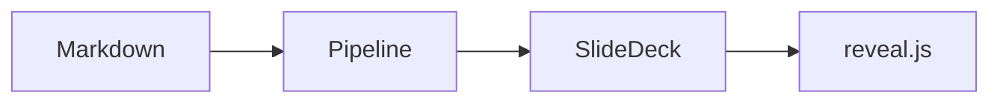

<grid dim="80 40" pos="center" style="color: #cdd6f4;">
# reveal-for-obsidian

Markdown notes → reveal.js slides :tada:

*Press → to begin*
</grid>

note:
Welcome the audience. This whole deck is a single Obsidian note.

---

<!-- .slide: background-color="#313244" -->

<grid dim="70 60" pos="center" style="color: #cdd6f4;">
## What's inside

- `<grid>` absolute positioning
- `<split>` columns
- fragments, shapes, speaker notes
- mermaid, charts, emoji, Font Awesome
</grid>

---

# Vertical slides

Press ↓ to see the sub-slide.

xxx

# Sub-slide

This page is stacked vertically (separated by `xxx`).

---

# Grid positioning

<grid dim="30 30" pos="topleft" style="background: #f38ba8; border-radius: 12px;">
topleft
</grid>

<grid dim="30 30" pos="-4 -6" style="background: #a6e3a1; border-radius: 12px;">
negative position: 4% from the right, 6% from the bottom
</grid>

<grid dim="20 20" pos="center" shape="hexagon" style="background: #89b4fa;">
shape="hexagon"
</grid>

---

# Split columns

<split even gap="2">
### Left :thumbsup:

- columns split on blank lines
- `even` = equal width

### Right :zap:

- `gap="2"` = 2em spacing
- `left`/`right` = flex weights
</split>

---

# Fragments

<grid dim="70 18" pos="20 15" frag="1" style="background: #f9e2af; border-radius: 8px;">
First click :point_right: frag="1"
</grid>

<grid dim="70 18" pos="20 40" frag="2" style="background: #fab387; border-radius: 8px;">
Second click :point_right: frag="2"
</grid>

<grid dim="70 18" pos="20 65" frag="fade-up" style="background: #cba6f7; border-radius: 8px;">
Named animations work too :point_right: frag="fade-up"
</grid>

---

# Code

```javascript
function greet(name) {
  // code blocks are syntax-highlighted
  return `Hello, ${name}!`;
}
```

Long code inside a small grid is auto-shrunk to fit.

---

# Emoji & Font Awesome

<grid dim="80 50" pos="center" style="color: #cdd6f4; font-size: 1.2em;">
:smile: `:smile:`  :heart: `:heart:`  :coffee: `:coffee:`  :rainbow: `:rainbow:`

:fas_rocket: `:fas_rocket:`  :fab_github: `:fab_github:`

*(Font Awesome icons need the FA stylesheet — see `remoteCSS` in this note's frontmatter; online only)*
</grid>

---

# Mermaid



---

# Chart.js

```chart
type: bar
labels: [Q1, Q2, Q3, Q4]
series:
  - title: Revenue
    data: [12, 19, 15, 24]
  - title: Costs
    data: [8, 11, 9, 13]
```

---

<!-- .slide: background-color="#45475a" -->

<grid dim="70 40" pos="center" style="color: #cdd6f4;">
## Element & slide comments

This slide's background comes from `<!-- .slide: background-color="#45475a" -->`.
</grid>

<grid dim="40 12" pos="center bottom" style="color: #f38ba8;">
This line is styled by an .element comment
<!-- .element: style="font-style: italic;" -->
</grid>

---

<grid dim="80 40" pos="center" style="color: #cdd6f4;">
# Thanks!

Export me: **Export Slides as PDF** or **Export Slides as HTML** :rocket:
</grid>

note:
Wrap up and show the export commands in the command palette.
